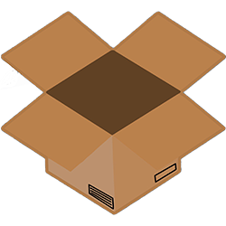

# FreeBox
Another DropBox analog\
Digital Design test task

## Features:
- Send file to server
- Download File

## How to run this app
You should run FreeBox.Server.WebApi for server project and FreeBox.Client.WpfClient for desktop app.\
If you want to use IIS or Kestrel on different address(https://localhost:7233) you should specify a new addres in FreeBox.Client.WebClient's App.conf

## Stack:
### Languages:
- C#
### Server:
- Asp.Net
- Entity Framework
### Client
- WPF
